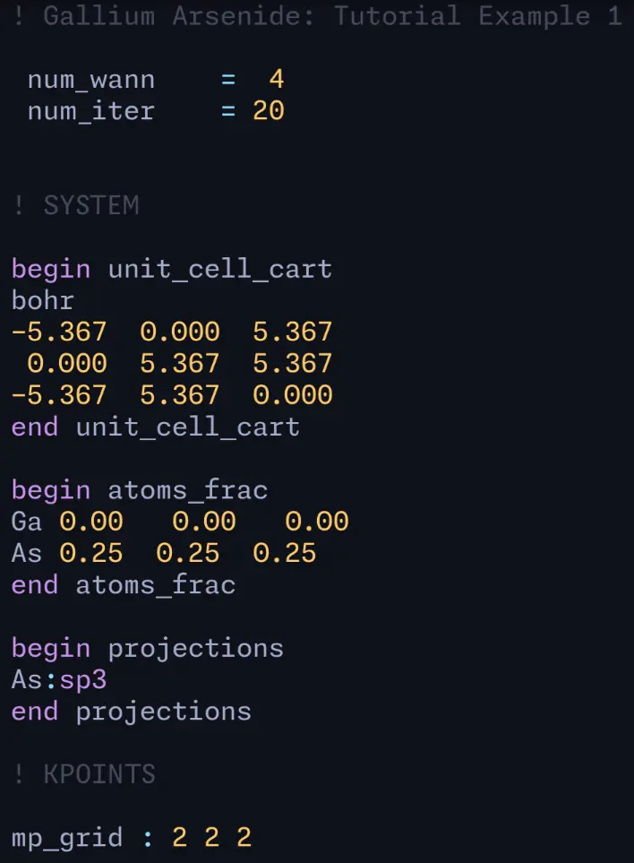

# tree-sitter-wannier90

[Wannier90](https://github.com/wannier-developers/wannier90) grammar for tree-sitter.

Provides syntax highlighting for `win` files.

<figure>

<figcaption>Syntax highlighting in <code>helix</code> editor with theme <code>material_deep_ocean</code> for <code>wannier90/example01/gaas.win</code>.</figcaption>
</figure>

## Usage

- Test it in CLI

    ```shell
    # Highlight file
    tree-sitter highlight example.win
    ```

- For `neovim`, see <https://github.com/nvim-treesitter/nvim-treesitter>
- For `helix`, see [`docs/helix.md`](docs/helix.md)

## Development

```shell
# Install dev dependencies
npm build

# Generate parser & language bindings
tree-sitter generate

# Test grammar
tree-sitter test
```

## Reference

See also [`tree-sitter-quantum_espresso`](https://github.com/qiaojunfeng/tree-sitter-quantum_espresso).

- <https://tree-sitter.github.io/tree-sitter/creating-parsers>
- <https://github.com/ikatyang/tree-sitter-toml>
- <https://github.com/stadelmanma/tree-sitter-fortran>
- <https://github.com/wannier-developers/wannier90>
